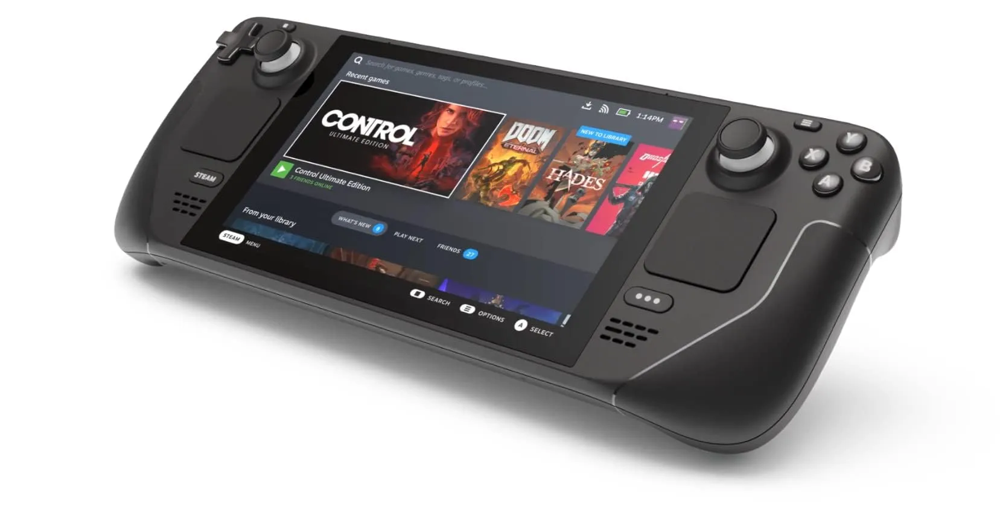
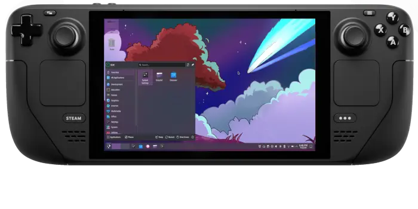

### O Hardware que Mudou o Jogo

O **Steam Deck** não é apenas um console portátil; é uma estação de trabalho Linux disfarçada. Equipado com uma APU customizada da AMD (Zen 2/RDNA 2), ele entrega uma performance por Watt que humilha laptops muito mais caros. A versão OLED trouxe refinamentos térmicos e uma bateria que finalmente aguenta sessões longas de jogos AAA.

*O Steam Deck OLED exibindo cores vibrantes em um painel de 90Hz.*

### SteamOS: O Poder do Arch Linux no Bolso

O coração do dispositivo é o **SteamOS 3.x**. Diferente das versões antigas baseadas em Debian, a Valve optou pelo **Arch Linux** para garantir pacotes sempre atualizados. 

O segredo do sucesso é o **Proton**, uma camada de compatibilidade baseada em WINE que traduz instruções DirectX para Vulkan em tempo real. Isso permite que milhares de jogos feitos exclusivamente para Windows rodem nativamente (e às vezes melhor) no Linux.

*O "lado PC" do Deck: KDE Plasma rodando no modo desktop.*

### Por que escolher este modelo?


- **Processador:** AMD APU 6nm (4-core/8-thread).
- **GPU:** 8 RDNA 2 CUs, performance estável em 800p.
- **Tela:** OLED HDR de 7.4" com pico de brilho de 1000 nits.
- **Sistema:** SteamOS 3 (Base Arch Linux) + Desktop KDE Plasma.
- **Armazenamento:** NVMe SSD expansível e slot MicroSD de alta velocidade.


---

### Onde Comprar (Melhores Preços)


Para iniciar a viagem ao mundo do Steam Deck, recomendo esse portátil da Valve, e você ainda ajuda o portal 🙂:





**Bizu do Linuxer:** Se você quer instalar apps fora da Steam Store, use o **Flatpak** no modo Desktop. O sistema de arquivos é imutável para garantir estabilidade, então o `pacman` não funciona por padrão (a menos que você desative o modo de leitura-apenas).


---

## Saiba Mais e Referências

Para aprofundar seu conhecimento sobre o hardware e as capacidades do sistema, confira estas fontes oficiais e comunidades de compatibilidade:

* **Página Oficial do Steam Deck:** [steamdeck.com](https://www.steamdeck.com) - Detalhes de hardware e versões disponíveis.
* **ProtonDB:** [protondb.com](https://www.protondb.com) - A base de dados essencial para saber se o seu jogo favorito roda bem no Linux.
* **Steam Deck HQ:** [steamdeckhq.com](https://steamdeckhq.com) - Guias de otimização de configurações de bateria e performance para cada jogo.
* **Wiki do Arch Linux:** [wiki.archlinux.org](https://wiki.archlinux.org/title/Steam_Deck) - Documentação técnica profunda sobre o sistema operacional do console.
* **GamingOnLinux:** [gamingonlinux.com](https://www.gamingonlinux.com) - Notícias atualizadas sobre o ecossistema de jogos FOSS