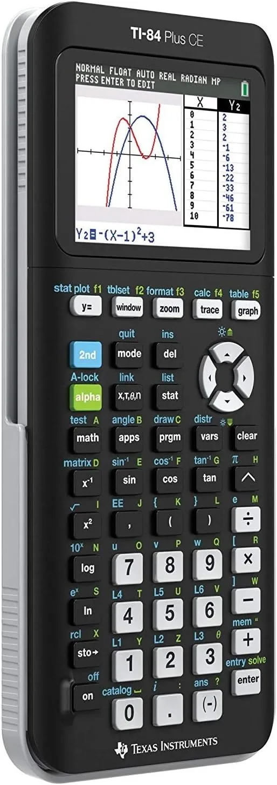

Padrão ouro em exames internacionais, a TI-84 Plus CE combina tela colorida vibrante e bateria recarregável para estudantes de engenharia e ciências.

## Análise Acurada da TI-84 Plus CE para Engenharia e Ciências

A Texas Instruments TI-84 Plus CE consolidou-se como uma das ferramentas de computação gráfica mais confiáveis no ambiente acadêmico e profissional. Em disciplinas que exigem visualização dinâmica de funções, como Cálculo Diferencial e Integral, Álgebra Linear e Estatística Avançada, a capacidade de renderizar gráficos coloridos em alta definição facilita a compreensão geométrica de equações complexas que seriam abstratas em telas de matriz de pontos tradicionais.

*O computador algébrico de bolso definitivo para engenharia.*

Diferente de modelos mais antigos, a variante CE (Color Edition) traz uma otimização significativa no consumo de memória e velocidade de processamento, permitindo que scripts de equações diferenciais e matrizes multidimensionais sejam resolvidos sem travamentos ou gargalos na interface de usuário.

### O Impacto da Visualização Gráfica Avançada

O grande diferencial deste equipamento reside na sua capacidade de sobrepor gráficos e analisar pontos de interseção, máximos, mínimos e derivadas numéricas em tempo real. A tela com tecnologia antirreflexo expande a usabilidade em laboratórios de física ou ambientes de campo iluminados, garantindo legibilidade total das curvas analíticas. 

Além disso, a estrutura de menus orientada a abas e atalhos diretos reduz a curva de aprendizado para estudantes que precisam de agilidade durante a resolução de exames de tempo limitado, como certificações internacionais e provas de engenharia core.

### Integração com Programação e Algoritmos

Para desenvolvedores e entusiastas de automação, a TI-84 Plus CE oferece suporte para programação em TI-Basic e Python (dependendo da revisão exata do firmware). Isso eleva o dispositivo de uma simples calculadora para um terminal portátil de testes lógicos, onde o usuário pode estruturar laços de repetição, condicionais e manipulação de arrays diretamente no hardware dedicado, isolado de distrações de sistemas operacionais desktop.

