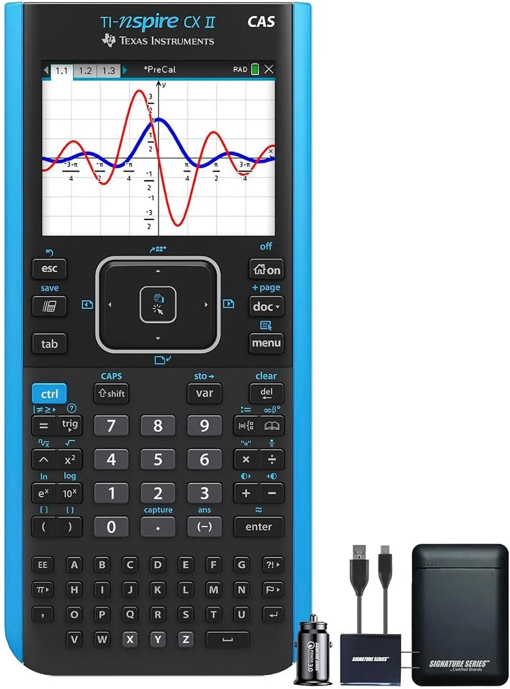

A TI-Nspire CX II CAS representa o ápice da computação algébrica portátil, unindo um motor de cálculo simbólico literal a um kit de carregamento dedicado para garantir autonomia máxima em rotinas severas de engenharia.

*A máquina de cálculo simbólico e Python definitiva para matemática avançada.*

## O Poder do Sistema Algébrico Computacional (CAS) no Ambiente Acadêmico

Para estudantes de engenharia, física teórica, matemática pura e ciências da computação, a TI-Nspire CX II CAS não opera como uma calculadora convencional, mas sim como um ecossistema portátil de matemática computacional avançada. O grande diferencial tecnológico da arquitetura CAS (Computer Algebra System) reside na capacidade do hardware de manipular variáveis de forma puramente simbólica e literal. Em termos práticos, isso significa que o dispositivo não apenas resolve o valor numérico de uma integral definida, mas devolve a expressão matemática genérica perfeitamente integrada, simplificando equações literais complexas, isolando incógnitas automaticamente e expandindo polinômios sem a necessidade de aproximações numéricas cras.

A interface do sistema operacional proprietário da Texas Instruments emula a lógica estrutural de computadores desktop modernos. O usuário pode criar documentos estruturados, gerenciar arquivos em pastas locais e abrir abas de trabalho dinâmicas que estabelecem comunicação de dados bidirecional em tempo real. Dessa forma, qualquer alteração paramétrica aplicada em uma célula de uma planilha estatística recalcula instantaneamente os coeficientes de uma matriz e atualiza a curva correspondente plotada no gráfico da aba adjacente.

### Programação em Python e Modelagem Computacional de Alto Nível

A consolidação da linha CX II trouxe como principal pilar de inovação em software a integração de um interpretador Python nativo de alta performance rodando diretamente no hardware isolado. Esse recurso transforma o dispositivo em uma estação portátil de testes lógicos e automação de rotinas de cálculo. Engenheiros e pesquisadores podem codificar scripts estruturados para o processamento digital de sinais, análise numérica vetorial e simulações de mecânica clássica ou quântica.

A tela colorida retroiluminada de alta resolução atua como o console de exibição principal, permitindo a plotagem de superfícies tridimensionais (3D). Com o uso do touchpad central integrado, o operador consegue rotacionar figuras geométricas no espaço flutuante para examinar planos tangentes, curvas de nível e pontos de sela com precisão cirúrgica.

### Conectividade Estabilizada e o Diferencial do Power Bundle

Um dos grandes gargalos de hardwares gráficos avançados de campo é a degradação da autonomia devido ao processamento intenso do display colorido e dos laços de repetição em Python. O pacote atual resolve essa vulnerabilidade ao incluir o kit de carregamento e adaptador de energia oficial estabilizado.

Carregar um dispositivo sensível desse porte diretamente em portas USB genéricas ou fontes paralelas de smartphones expõe o circuito integrado e a bateria de íons de lítio a flutuações de tensão nocivas. O uso do carregador dedicado garante ciclos de carga limpos e eficientes, preservando a vida útil do componente químico e assegurando que o ecossistema esteja pronto para semanas consecutivas de exames, projetos e modelagens laboratoriais intensas de nível corporativo.

