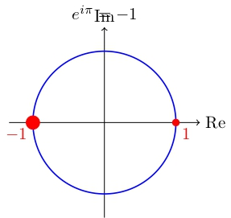
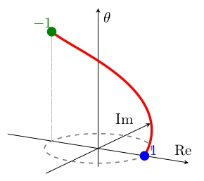

A **Identidade de Euler** é frequentemente chamada de "a equação mais bonita da matemática" por sua capacidade de conectar, em uma expressão simples, cinco números fundamentais de diferentes áreas.

$$e^{i\pi} + 1 = 0$$


**Os Cinco Números:**
- **0**: Neutro da adição (Aritmética)
- **1**: Neutro da multiplicação (Aritmética)
- **π**: Constante da circunferência (Geometria)
- **e**: Base dos logaritmos naturais (Cálculo/Análise)
- **i**: Unidade imaginária (Álgebra Complexa)


### A Origem: Fórmula de Euler

A identidade é um caso particular da **Fórmula de Euler**, que estabelece a ponte entre funções exponenciais e trigonométricas:

$$e^{i\theta} = \cos \theta + i \sin \theta$$

Substituindo $\theta = \pi$:

$$e^{i\pi} = \cos \pi + i \sin \pi$$

Sabendo que $\cos \pi = -1$ e $\sin \pi = 0$:

$$e^{i\pi} = -1$$

Rearranjando, chegamos à forma clássica:

$$e^{i\pi} + 1 = 0$$

### Interpretação Geométrica

No plano complexo, a expressão $e^{i\theta}$ representa um ponto no círculo unitário. Quando $\theta = \pi$, percorremos metade do círculo, partindo de 1 (ângulo 0) e chegando a -1 (ângulo $\pi$). A identidade diz que esse ponto somado a 1 retorna à origem (0).

<figure>
  
  <figcaption>Identidade de Euler no Plano Complexo em 2D</figcaption>
</figure>

<figure>
  
  <figcaption>Identidade de Euler no Plano Complexo em 3D</figcaption>
</figure>


**Bizu de Visualização:** A fórmula de Euler $e^{i\theta} = \cos\theta + i\sin\theta$ é a chave para entender oscilações e ondas. Na prática, ela simplifica drasticamente problemas de engenharia elétrica, processamento de sinais e física quântica, transformando trigonometria em exponenciais mais fáceis de manipular.


### Por que isso importa?

Além da beleza teórica, essa identidade é a base para a análise de sinais (transformadas de Fourier) e para a descrição de fenômenos periódicos no mundo real, desde ondas de rádio até o comportamento de partículas subatômicas.

## Ferramentas para Estudo

Para iniciar a viagem ao mundo do cálculo, recomendo esse livro clássico do Professor Wilfred Kaplan, e você ainda ajuda o portal 🙂:



