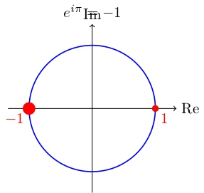
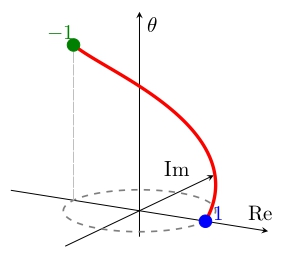

A **Identidade de Euler** é frequentemente aclamada por matemáticos e físicos como a equação mais bonita da matemática. A razão para tal prestígio não é apenas estética: em uma única expressão de extrema concisão, ela estabelece uma ponte direta entre os cinco números fundamentais de ramificações inteiramente distintas da matemática.

$$e^{i\pi} + 1 = 0$$


**Os Cinco Números Fundamentais:**
- **0**: O elemento neutro da adição, pilar da aritmética e da álgebra.
- **1**: O elemento neutro da multiplicação, base dos sistemas de contagem.
- **π**: A constante circular que conecta o perímetro ao diâmetro de uma circunferência (Geometria).
- **e**: A base dos logaritmos naturais, constante central do cálculo e do crescimento contínuo (Análise Matemática).
- **i**: A unidade imaginária definida por $i^2 = -1$, fundação do corpo dos números complexos (Álgebra Complexa).




## Contexto Histórico: A Visão de Leonhard Euler

Para compreender como essa relação foi descoberta, é necessário retornar ao século XVIII. O matemático suíço **Leonhard Euler** publicou, em 1748, sua obra monumental *Introductio in analysin infinitorum*. Nesse tratado, Euler unificou o cálculo infinitesimal e a trigonometria, áreas que até então eram tratadas quase como disciplinas independentes.


Texto original fundamentando a transição das funções trigonométricas para expansões em séries infinitas e a consolidação do símbolo $e$ e da identidade $e^{i\theta} = \cos\theta + i\sin\theta$.


Antes de Euler, as funções trigonométricas ($\sin$, $\cos$) eram vistas puramente como razões geométricas calculadas sobre triângulos retângulos ou círculos. Euler percebeu que, ao expandir essas funções em **séries infinitas de potências**, elas revelavam uma estrutura algébrica idêntica à da função exponencial.

A introdução da unidade imaginária $i$ permitiu que os números saíssem da reta real unidimensional e passassem a habitar o plano bi-dimensional. A combinação do cálculo infinitesimal com o plano complexo abriu espaço para a criação do ramo da **Análise Complexa**, essencial para as engenharias modernas.

---

## Demonstrando a Fórmula de Euler via Séries de Taylor

A Identidade de Euler não é uma definição arbitrária; ela é um caso particular de um resultado mais amplo conhecido como **Fórmula de Euler**. A forma mais rigorosa e intuitiva de derivar essa fórmula é por meio das Séries de Taylor de Maclaurin para funções reais estendidas ao domínio complexo.

Revisitemos as expansões em série de potências para as funções $e^x$, $\cos x$ e $\sin x$ em torno de $x = 0$:

$$e^x = \sum_{n=0}^{\infty} \frac{x^n}{n!} = 1 + x + \frac{x^2}{2!} + \frac{x^3}{3!} + \frac{x^4}{4!} + \frac{x^5}{5!} + \dots$$

$$\cos x = \sum_{n=0}^{\infty} \frac{(-1)^n x^{2n}}{(2n)!} = 1 - \frac{x^2}{2!} + \frac{x^4}{4!} - \frac{x^6}{6!} + \dots$$

$$\sin x = \sum_{n=0}^{\infty} \frac{(-1)^n x^{2n+1}}{(2n+1)!} = x - \frac{x^3}{3!} + \frac{x^5}{5!} - \frac{x^7}{7!} + \dots$$

### O Comportamento Cíclico das Potências de $i$

Ao substituir a variável real $x$ pela variável imaginária $i\theta$ na série exponencial $e^x$, devemos observar a periodicidade das potências da unidade imaginária $i$:

* $i^1 = i$
* $i^2 = -1$
* $i^3 = -i$
* $i^4 = 1$
* $i^5 = i$

Aplicando $x = i\theta$ na expansão de $e^x$:

$$e^{i\theta} = 1 + (i\theta) + \frac{(i\theta)^2}{2!} + \frac{(i\theta)^3}{3!} + \frac{(i\theta)^4}{4!} + \frac{(i\theta)^5}{5!} + \dots$$

Desenvolvendo as potências de $i$:

$$e^{i\theta} = 1 + i\theta - \frac{\theta^2}{2!} - i\frac{\theta^3}{3!} + \frac{\theta^4}{4!} + i\frac{\theta^5}{5!} - \dots$$

### Reagrupando os Termos Reais e Imaginários

Como a série é absolutamente convergente para todo $\theta \in \mathbb{R}$, podemos separar os termos em duas partes: uma contendo apenas termos reais e outra contendo a unidade imaginária $i$ em evidência.

$$e^{i\theta} = \left( 1 - \frac{\theta^2}{2!} + \frac{\theta^4}{4!} - \dots \right) + i \left( \theta - \frac{\theta^3}{3!} + \frac{\theta^5}{5!} - \dots \right)$$

Comparando essa expressão com as séries de Taylor do seno e do cosseno apresentadas anteriormente, notamos a identidade:

$$e^{i\theta} = \cos \theta + i \sin \theta$$

Esta é a **Fórmula de Euler**. 

### O Caso Particular de $\theta = \pi$

Para chegar à famosa Identidade de Euler, basta avaliar a função no ângulo $\theta = \pi$ radianos (equivalente a $180^\circ$):

$$e^{i\pi} = \cos \pi + i \sin \pi$$

Substituindo os valores conhecidos das funções trigonométricas no ponto $\pi$:
* $\cos \pi = -1$
* $\sin \pi = 0$

$$e^{i\pi} = -1 + i(0)$$

$$e^{i\pi} = -1$$

Somando $1$ em ambos os lados da equação, obtemos a forma canônica:

$$e^{i\pi} + 1 = 0$$

---

## Interpretação Geométrica no Plano de Argand-Gauss

Entender a equação do ponto de vista puramente algébrico revela sua precisão, mas a interpretação geométrica oferece uma intuição sobre o comportamento dos números complexos sob exponenciação.

No plano complexo (Plano de Argand-Gauss), o eixo horizontal representa a **Parte Real ($\text{Re}$)** e o eixo vertical representa a **Parte Imaginária ($\text{Im}$)**. Qualquer número complexo $z$ pode ser escrito na forma polar $z = r e^{i\theta}$, onde $r$ é o módulo (distância até a origem) e $\theta$ é o argumento (ângulo de rotação em relação ao eixo real positivo).

A expressão $e^{i\theta}$ possui módulo igual a $1$ para qualquer valor de $\theta$. Portanto, ela define um **movimento circular uniforme** ao longo do círculo unitário no plano complexo.

<figure>
  
  <figcaption>Identidade de Euler no Plano Complexo em 2D: Rotação de π radianos no vetor unitário.</figcaption>
</figure>

Quando iniciamos em $\theta = 0$, temos $e^{i(0)} = 1$. Conforme o valor de $\theta$ aumenta, o vetor começa a girar no sentido anti-horário. Ao atingirmos $\theta = \pi$, percorremos exatamente meia volta sobre o círculo unitário. O vetor apontará para a direção oposta, atingindo o ponto real $-1$.

A soma com $1$ na equação nada mais é do que a translação vetorial desse ponto de volta para a origem $(0,0)$.


Obra recomendada para aprofundar o entendimento geométrico e intuitivo da análise complexa, transformações conforme e Mapeamentos de Mbius sem dependência excessiva de formalismo algébrico árido.


### Extensão Tridimensional: A Hélice Complexa

Ao adicionarmos o parâmetro do tempo ou da frequência como um terceiro eixo (variando $\theta$), a trajetória de $e^{i\theta}$ deixa de ser um simples círculo no plano e transforma-se em uma **hélice tridimensional** no espaço $(\text{Re}, \text{Im}, \theta)$.

<figure>
  
  <figcaption>Trajetória Helicoidal de $e^{i\theta}$ em 3D: A projeção nos eixos produz as ondas seno e cosseno.</figcaption>
</figure>

Essa perspectiva em 3D ajuda a visualizar que o movimento circular no plano complexo é a combinação simultânea de duas ondas senoidais defasadas em $90^\circ$ nos eixos real e imaginário. A projeção dessa hélice no plano real gera a curva do cosseno, enquanto a projeção no plano imaginário gera a curva do seno.


**Bizu de Visualização:** A fórmula de Euler $e^{i\theta} = \cos\theta + i\sin\theta$ funciona como um tradutor universal. Ela converte rotações complexas e oscilações trigonométricas pesadas em operações de exponenciação simples. Multiplicar dois números complexos equivale a somar seus ângulos de rotação — princípio base dos [algoritmos de computação gráfica e simulações físicas](/matematica/regras-divisibilidade-matematica-elementar-algoritmos/).


---

## Relevância Prática e Aplicações em Engenharia

Embora pareça uma curiosidade puramente teórica, a Identidade de Euler e a Fórmula de Euler são ferramentas indispensáveis para a engenharia moderna e a ciência da computação.

### 1. Engenharia Elétrica e Análise de Circuitos
Em circuitos elétricos de Corrente Alternada (CA), as tensões e correntes oscilam senoidalmente. Resolver equações diferenciais contendo senos e cossenos para circuitos complexos é computacionalmente ineficiente. Utilizando a notação fasorial baseada na fórmula de Euler, engenheiros convertem equações diferenciais em simples sistemas de equações algébricas complexas.

### 2. Processamento Digital de Sinais (DSP) e Transformada de Fourier
A **Transformada Discreta de Fourier (DFT)** e o algoritmo da **Transformada Rápida de Fourier (FFT)** — fundações da compressão de áudio (MP3), imagem (JPEG) e transmissões 5G/Wi-Fi — dependem da expanção em expoentes complexos:

$$X_k = \sum_{n=0}^{N-1} x_n \cdot e^{-i 2\pi k n / N}$$

Sem a capacidade de manipular sinais senoidais como exponenciais imaginárias via Euler, o processamento de áudio, imagem e dados em tempo real seria ordens de grandeza mais lento do ponto de vista algorítmico.

### 3. Física Quântica
A mecânica quântica descreve o comportamento de partículas subatômicas por meio de equações de onda complexas. A célebre **Equação de Schrödinger** depende intrinsecamente da unidade imaginária $i$ e de termos exponenciais da forma $e^{-iEt/\hbar}$ para descrever a evolução temporal da função de onda de um sistema físico.