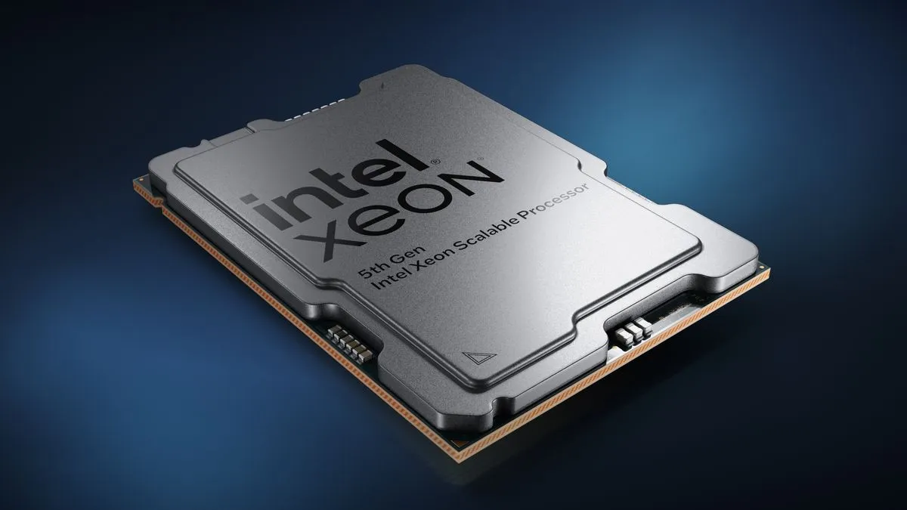

### Introdução

Quando pensamos em laptops potentes, o senso comum aponta para as linhas Core i7 ou i9. Mas para o usuário de **Linux** que lida com compilação de código ou simulações matemáticas, existe um segredo no mercado de usados: as **Mobile Workstations com Intel Xeon**.

A linha Xeon não é apenas sobre "velocidade de clock", mas sobre **sustentabilidade de carga**. Enquanto um laptop comum reduz o desempenho para não superaquecer, a Workstation Xeon foi projetada para manter o "pé no fundo" indefinidamente.

---

📌 **Conteúdo do Bizu:**

* 🧬 [O que diferencia um Xeon de um Core i9?](#diferenciais)
* 🛡️ [Durabilidade e Confiabilidade: O Tanque de Guerra](#durabilidade)
* 🐧 [A Experiência no Linux: Estabilidade Total](#linux-focus)
* 🛠️ [Windows vs Linux no Xeon](#comparativo)
* 💰 [Onde encontrar Qualidade x Preço Baixo](#mercado)
* 📚 [Veredito Técnico](#veredito)

---

<h2 id="diferenciais">🧬 Anatomia da Workstation: Xeon vs Core i9</h2>

  

    
[ 01 ]

    

Memória ECC

  

  

    Suporte a <strong>Error Correction Code</strong>. Essencial para cálculos de longa duração.
    

      Evita o temido <em>Kernel Panic</em> por bit-flip.
    

  

  

    
[ 02 ]

    

Cache L3 Massivo

  

  

    Maior largura de banda para dados e instruções.
    

      Otimizado para multitarefa pesada e Docker.
    

  

<h2 id="durabilidade">🛡️ Durabilidade e Confiabilidade: O Tanque de Guerra</h2>

Um processador Xeon é certificado para operar em ambientes críticos. Em laptops como o **ThinkPad P52**, essa CPU é acompanhada por carcaças com certificação militar (MIL-STD-810G), teclados resistentes a líquidos e sistemas de dissipação de calor duplos. 

Diferente de laptops ultra-finos que se degradam com o calor em 2 anos, um Xeon de 2019/2020 ainda entrega uma estabilidade de sinal e integridade de componentes muito superior aos modelos de entrada atuais.

<h2 id="linux-focus">🐧 A Experiência no Linux: Estabilidade Total</h2>

No Linux, o Xeon é tratado como "realeza". Enquanto processadores muito novos às vezes sofrem com o escalonamento de núcleos (P-cores e E-cores), a arquitetura Xeon é extremamente sólida.


**Bizu de Hardware:** Ao usar uma Workstation Xeon com Linux, você terá suporte nativo a quase todos os sensores via `lm-sensors`. A gestão térmica nessas máquinas é superior, evitando o *thermal throttling*.


<h2 id="comparativo">🛠️ Windows vs Linux no Xeon</h2>

* **No Windows:** Você tem uma máquina sólida, mas muitas vezes limitada por telemetria e processos de fundo.
* **No Linux:** O sistema "voa". Compilar o Kernel em um Xeon de 8 núcleos físicos é uma experiência visceral. A multitarefa no **Ubuntu 26.04** não apresenta engasgos, mesmo com instâncias Docker rodando.

### Desenvolvimento e Provas

> PROVA_TECNICA_LOG:

A probabilidade de um erro de memória (Soft Error) aumenta com o uptime. O Xeon mitiga isso através de algoritmos de Hamming aplicados ao hardware:

$$P(\text{erro}) \rightarrow 0 \text{ com ECC Ativo}$$

Ideal para simulações matemáticas que rodam por horas.

<h2 id="mercado">💰 Onde encontrar Qualidade x Preço Baixo</h2>

No **Brasil**, essas máquinas ganharam muita força no mercado de *ex-leasing*. Grandes consultorias e bancos renovam frotas de 3 em 3 anos, disponibilizando equipamentos de elite (que custariam R$ 20.000) por preços extremamente competitivos em plataformas como o Mercado Livre.

Modelos recomendados:
* **Lenovo ThinkPad P51/P52:** Teclados lendários e durabilidade militar.
* **Dell Precision 7520/7530:** Facilidade extrema de manutenção e upgrades.

<h2 id="veredito">📚 Veredito Técnico</h2>

Se você prioriza **durabilidade** e **precisão de dados** acima de portabilidade extrema, um laptop Xeon é o seu próximo upgrade.

---

## Ferramentas Recomendadas


Selecionamos as melhores opções de custo-beneficio para quem quer entrar no mundo das Mobile Workstations:



