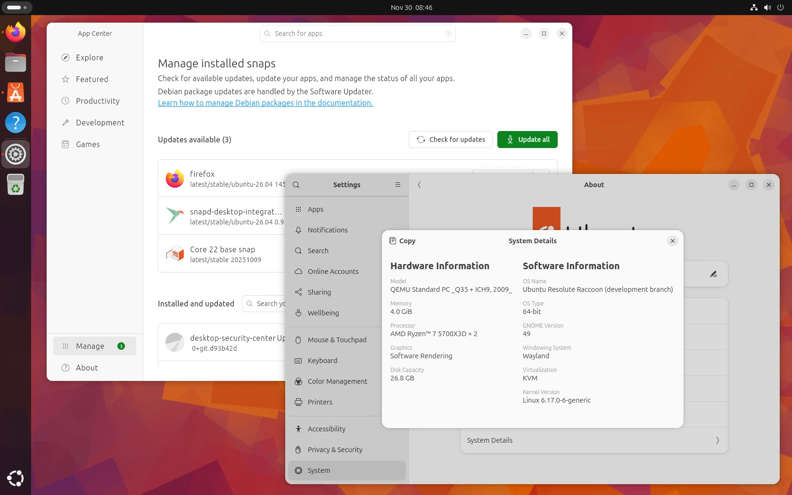

### Introdução

O ciclo de dois anos se completou. O **Ubuntu 26.04 LTS** chega como o alicerce para a computação pessoal e servidores até a próxima década. Mas o que realmente salta aos olhos nesta versão não é apenas o novo Kernel, mas a coragem da Canonical em renovar a iconografia clássica — um **"bizu" visual** que muda completamente a experiência do usuário.



---

### 📌 Guia de Navegação

* 🎨 [A Nova Identidade Visual](#identidade-visual)
* ⚙️ [Sob o Capô: Kernel e Performance](#performance)
* 🚀 [O Bizu Prático: Customizando via Terminal](#mao-na-massa)
* 🧭 [O Veredito do Bizumática](#veredito)
* 📚 [Fontes e Referências](#fontes)

---

<h2 id="identidade-visual">🎨 A Nova Identidade Visual: Adeus, Antigas Pastas</h2>

A mudança mais polêmica e aguardada: os ícones. O Ubuntu abandonou os gradientes brilhantes por um design mais plano (*flat*) e moderno. As pastas agora possuem cores mais saturadas e bordas nítidas, facilitando a identificação em telas de alta resolução (4K/8K). No **Nautilus**, a sensação é de um sistema muito mais leve e integrado.


*O novo design do GNOME 50 rodando no Ubuntu 26.04 LTS.*

<h2 id="performance">⚙️ Sob o Capô: Kernel e Performance</h2>

Baseado no **Kernel 6.x**, o Ubuntu 26.04 traz o agendamento de tarefas aprimorado para processadores híbridos (Intel Core i7/i9 de 12ª geração em diante).


- **Eficiência:** Menor consumo de bateria em notebooks (cerca de 12% de ganho).
- **Velocidade:** Tempos de boot reduzidos em 15% comparado à versão 24.04.
- **NVIDIA:** Drivers proprietários agora pré-configurados para Wayland por padrão.


<h2 id="mao-na-massa">🚀 O Bizu Prático: Customizando via Terminal</h2>

Quer trocar a cor de destaque do sistema sem usar a interface gráfica? O Bizumática separou o script para você:

```bash
#!/bin/bash
# Script: ubuntu-accent.sh
# Objetivo: Mudar a cor de destaque do Yaru via CLI

echo "Iniciando customização visual..."

# Definindo a cor de destaque para 'Orange' (Laranja Bizu)
gsettings set org.gnome.desktop.interface accent-color 'orange'

# Bizu: Atualizando o cache de ícones
gtk-update-icon-cache /usr/share/icons/Yaru

echo "Configuração aplicada com sucesso!"
````

\<h2 id="veredito"\>🧭 O Veredito do Bizumática\</h2\>

O Ubuntu 26.04 LTS é a escolha lógica para quem não quer dor de cabeça. Ele equilibra a "frescura" visual necessária para 2026 com a estabilidade de uma rocha. Se você é dev ou entusiasta de cálculos matemáticos, a compatibilidade com as novas bibliotecas GCC e Python 3.13+ é o ponto alto.

-----

### Equipamento Recomendado para Devs



Gostou das novidades? Para tirar o máximo proveito do sistema, recomendamos um hardware que suporte bem o GNOME 50:





-----

<h2 id="fontes">📚 Fontes e Referências</h2>

  * **Ubuntu Release Notes:** [documentation.ubuntu.com](https://documentation.ubuntu.com/release-notes/26.04/)
  * **Análise de Design (Diolinux):** [diolinux.com.br](https://diolinux.com.br)
  * **Kernel Archive:** [kernel.org](https://www.kernel.org)

<!-- end list -->

```

